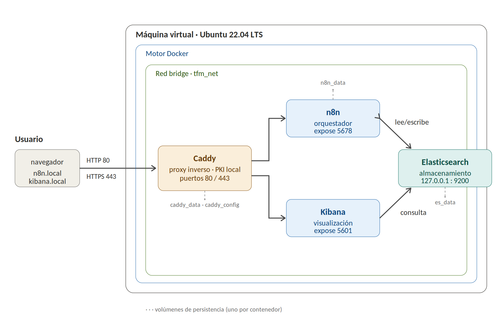
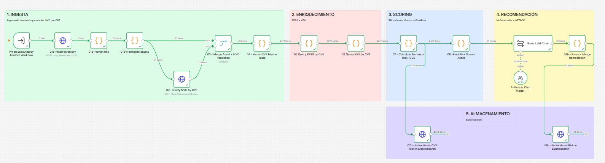
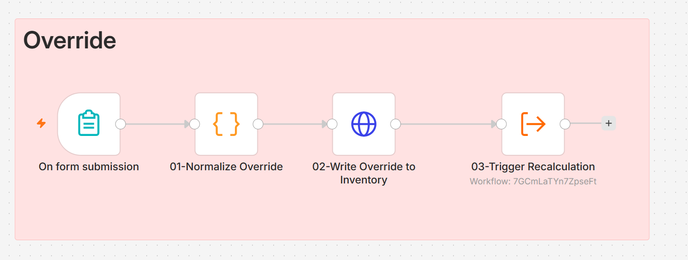
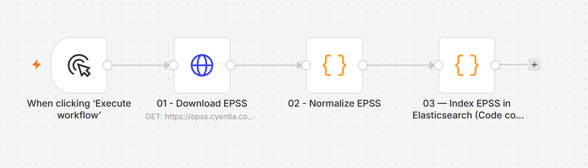
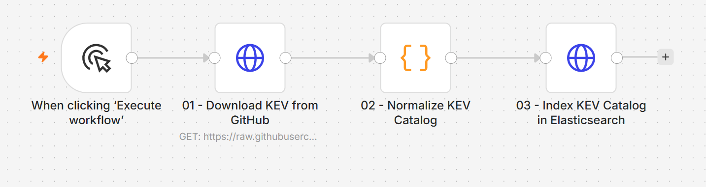

# Modelo de priorización contextual del riesgo

Este documento describe la propuesta del trabajo: el modelo de priorización de
vulnerabilidades sensible al contexto del activo y la arquitectura del sistema que
lo implementa.

## Contenido

1. [Pregunta de investigación](#1-pregunta-de-investigación)
2. [Modelo de scoring](#2-modelo-de-scoring)
3. [Arquitectura del sistema](#3-arquitectura-del-sistema)

---

## 1. Pregunta de investigación

La priorización del riesgo de vulnerabilidades reconoce el contexto del activo como
determinante, pero ese contexto se incorpora de forma heterogénea en los modelos y,
en las plataformas comerciales, con una ponderación que no siempre es completamente
auditable. La literatura reciente (Jiang et al., 2025) identifica la integración de
factores contextuales en un modelo explícito y reproducible como una de las brechas
significativas en la priorización de vulnerabilidades.

Este trabajo propone un modelo que separa dos planos habitualmente fundidos en una
única puntuación: el **riesgo técnico** de la vulnerabilidad (CVSS, EPSS, KEV) y el
**contexto del activo**, formalizado en un factor independiente y explícito
—el ContextFactor— con pesos declarados y cálculo trazable hasta los datos y
criterios de parametrización. La priorización deja de recaer sobre la vulnerabilidad
para recaer sobre el activo que la contiene, y el contexto pasa de ser un ajuste
implícito a una componente auditable del resultado.

La pregunta que articula el trabajo es: *¿en qué medida la incorporación sucesiva de
señales de explotación y del contexto arquitectónico del activo modifica la
priorización obtenida a partir de la severidad técnica de la vulnerabilidad?*

---

## 2. Modelo de scoring

El modelo separa el **riesgo técnico** de la vulnerabilidad (propio del CVE) del
**contexto del activo** que la presenta, y combina ambos en una puntuación final
acotada en el rango [0, 1].

### 2.1. Riesgo técnico (TR)

El riesgo técnico se calcula por CVE a partir de tres fuentes normalizadas al
rango [0, 1]:

```
TR = 0.40 * CVSS_norm + 0.35 * EPSS_norm + 0.25 * KEV_norm
```

- **CVSS_norm**: severidad base del CVE (CVSS / 10).
- **EPSS_norm**: probabilidad de explotación en los próximos 30 días (valor EPSS directo, ya en [0, 1]).
- **KEV_norm**: pertenencia al catálogo KEV de CISA (1 si el CVE figura en KEV, 0 en caso contrario).

El TR se calcula para cada CVE asociado a un activo. Para el riesgo final se emplea
la **CVE dominante** del activo: la de mayor TR (TR_top).

### 2.2. Factor de contexto (CF)

El contexto pertenece al **activo**, no al CVE. El CF se aplica una sola vez por
activo, sobre su TR_top:

```
CF = 0.30 * Exposure_norm
   + 0.20 * (1 + H) * Criticality_norm
   + 0.20 * (1 - H) * ModuleSensitivity_norm
   + 0.30 * BlastRadius_norm
```

- **Exposure_norm**: grado de exposición del activo.
- **Criticality_norm**: criticidad del activo para el negocio.
- **ModuleSensitivity_norm**: sensibilidad del módulo funcional al que pertenece el activo.
- **BlastRadius_norm**: radio de impacto del módulo, calculado sobre la topología (N = 9 módulos).

**Factor H (override de criticidad).** `H` es un factor binario que controla la
ponderación entre criticidad y sensibilidad del módulo:

- **H = 0** (por defecto): criticidad y sensibilidad del módulo pesan 0.20 cada una.
- **H = 1** (cuando `criticality_overridden = true`): la criticidad duplica su peso
  (0.20 -> 0.40) y la sensibilidad del módulo se anula (0.20 -> 0).

El override se activa mediante un formulario (n8n Form Trigger) cuando un
responsable declara explícitamente la criticidad de un activo, sustituyendo el
valor derivado del módulo por un juicio experto trazable.

### 2.3. Riesgo final (FinalRisk)

```
FinalRisk = TR_top * (1 + CF) / 2      (rango [0, 1])
```

El contexto actúa como **modulador** del riesgo técnico: un mismo CVE con idéntico
TR produce distintos FinalRisk según el activo que lo presente.

### 2.4. Umbrales de clasificación

| Nivel   | Rango            |
|---------|------------------|
| CRÍTICO | FinalRisk ≥ 0.80 |
| ALTO    | FinalRisk ≥ 0.60 |
| MEDIO   | FinalRisk ≥ 0.40 |
| BAJO    | FinalRisk < 0.40 |

### 2.5. Ejemplo de diferenciación contextual

DC-01 y JMP-01 comparten el mismo CVE (CVE-2025-59287) y el mismo riesgo técnico
(TR = 0.9918), pero producen puntuaciones finales distintas:

| Activo  | TR_top | FinalRisk | Nivel   |
|---------|--------|-----------|---------|
| DC-01   | 0.9918 | 0.883     | CRÍTICO |
| JMP-01  | 0.9918 | 0.846     | CRÍTICO |

La diferencia se debe al distinto radio de impacto (blast radius) de los módulos a
los que pertenecen. El ContextFactor, aplicado de forma explícita y con pesos
declarados sobre la CVE dominante del activo, reordena la prioridad entre dos activos
que la severidad técnica igualaría, y lo hace de forma trazable y reproducible.

---

## 3. Arquitectura del sistema

La plataforma integra fuentes de vulnerabilidad (NVD, EPSS, KEV) con el contexto de
los activos, orquestado sobre una infraestructura de contenedores. El diseño
prioriza la **auditabilidad**: cada transformación es un nodo explícito y trazable.

### 3.1. Despliegue



*Despliegue sobre una máquina virtual Ubuntu: los cuatro servicios se ejecutan como
contenedores en una red bridge interna (`tfm_net`). Caddy actúa como proxy inverso
con PKI local; Elasticsearch se expone únicamente en `127.0.0.1:9200`. Cada
contenedor persiste sus datos en un volumen propio.*

| Servicio       | Imagen                 | Rol                                              |
|----------------|------------------------|--------------------------------------------------|
| Elasticsearch  | elasticsearch:8.15.3   | Almacenamiento e indexación de inventario y riesgo |
| Kibana         | kibana:8.15.3          | Visualización (dashboards, slopegraph, tablas)   |
| n8n            | n8nio/n8n:latest       | Orquestación del pipeline de scoring             |
| Caddy          | caddy:2                | Reverse proxy con PKI local (HTTPS)              |

### 3.2. Índices de Elasticsearch

| Índice                 | Contenido                                    | Clave de documento     |
|------------------------|----------------------------------------------|------------------------|
| `asset-inventory-v1`   | Inventario de activos (fuente de verdad)     | asset_id               |
| `technical-risk-cve`   | Riesgo técnico por par activo-CVE            | asset_id + cve_id      |
| `asset-final-risk`     | Riesgo final por activo (21 documentos)      | asset_id (idempotente) |
| `epss-scores`          | Dataset EPSS completo (~352.707 CVE, local)  | cve_id                 |
| `kev-catalog`          | Catálogo KEV de CISA (local)                 | cve_id                 |

El índice `technical-risk-cve` emplea campos `text` con subcampo `.keyword`; los
demás emplean mayoritariamente `keyword` directo. Esto condiciona la forma de las
agregaciones y de las dimensiones en Kibana Lens.

#### Esquema del inventario (`asset-inventory-v1`)

Cada activo del inventario declara los campos siguientes. La columna *origen*
distingue si el valor se declara directamente, se deriva de otros campos o lo
calcula el pipeline.

| Campo                        | Tipo    | Origen     | Descripción                                                     |
|------------------------------|---------|------------|-----------------------------------------------------------------|
| `asset_id`                   | keyword | declarado  | Identificador único del activo (p. ej. WEB-01)                  |
| `asset_name`                 | keyword | declarado  | Nombre descriptivo                                              |
| `asset_type`                 | keyword | declarado  | Tipo de activo                                                  |
| `asset_version`              | keyword | declarado  | Versión del software                                            |
| `software`                   | keyword | declarado  | Producto de software                                           |
| `cpe_name`                   | keyword | declarado  | CPE 2.3 empleado para consultar NVD                            |
| `exposure`                   | keyword | declarado  | Grado de exposición (internet, internal, restricted_internal)  |
| `module_id`                  | keyword | declarado  | Módulo funcional al que pertenece el activo                    |
| `criticality`                | keyword | derivado   | Criticidad del activo                                          |
| `criticality_norm`           | float   | calculado  | Criticidad normalizada [0, 1]                                  |
| `blast_radius_norm`          | float   | calculado  | Radio de impacto normalizado del módulo                        |
| `blast_radius_status`        | keyword | calculado  | Estado del cálculo de blast radius                             |
| `criticality_overridden`     | boolean | declarado  | Indica si la criticidad se declaró por override (factor H)     |
| `criticality_override_level` | keyword | declarado  | Nivel declarado en el override (null si no aplica)             |
| `criticality_score`          | integer | derivado   | Puntuación de criticidad del override                         |
| `override_justification`     | text    | declarado  | Justificación del override (null si no aplica)                |
| `override_timestamp`         | date    | declarado  | Momento del override (null si no aplica)                       |

Los campos de override permanecen a `null` / `false` mientras no se declare una
criticidad explícita mediante `workflow-override`.

### 3.3. Pipeline principal (workflow-main)



*Flujo del pipeline: recuperación del inventario, consulta a NVD por CPE,
enriquecimiento con EPSS y KEV, cálculo del riesgo técnico por CVE, aplicación del
factor de contexto por activo y persistencia del resultado.*

La secuencia de nodos, con la numeración del propio workflow:

| # Nodo | Nombre                            | Función                                                      |
|--------|-----------------------------------|-------------------------------------------------------------|
| —      | When Executed by Another Workflow | Punto de entrada del pipeline                               |
| 01a    | Fetch inventory                   | Recupera el inventario desde `asset-inventory-v1`          |
| 01b    | Flatten hits                      | Aplana la respuesta de Elasticsearch                       |
| 01c    | Normalize assets                  | Normaliza los campos del activo                            |
| 02     | Query NVD by CPE                  | Consulta la API de NVD por CPE                            |
| 03     | Merge Asset + NVD Response        | Une cada activo con sus CVE                                |
| 04     | Asset-CVE Master Table            | Construye la tabla maestra activo-CVE                     |
| 05     | Query EPSS by CVE                 | Añade la probabilidad EPSS local a cada CVE               |
| 06     | Query KEV by CVE                  | Marca la pertenencia al catálogo KEV                      |
| 07     | Calculate Technical Risk (CVE)    | Calcula TR por CVE                                         |
| 07b    | Index Asset-CVE Risk              | Indexa el TR por par activo-CVE en `technical-risk-cve`   |
| 08     | Final Risk Score (Asset)          | Aplica CF sobre el TR_top y calcula FinalRisk por activo   |
| —      | Basic LLM Chain (Anthropic)       | Genera técnica ATT&CK, remediación y rationale            |
| 08b    | Parse + Merge Remediation         | Integra la salida del modelo en el documento del activo    |
| 08c    | Index Asset Risk                  | Indexa el riesgo final en `asset-final-risk`             |

El nodo **07** calcula el riesgo técnico por cada CVE y bifurca: una rama (**07b**)
persiste el detalle activo-CVE; la otra (**08**) selecciona el TR más alto del
activo, le aplica el factor de contexto una sola vez y obtiene el FinalRisk. El
contexto pertenece al activo, no al CVE.

### 3.4. Flujos auxiliares

Además del pipeline principal, el sistema incorpora tres flujos de soporte.

**workflow-override** — formulario (n8n Form Trigger) para declarar explícitamente
la criticidad de un activo. Activa el factor H (`criticality_overridden = true`),
sustituyendo la criticidad derivada del módulo por un juicio experto trazable, y
dispara el recálculo del activo.

<p align="center">
  <br>
  <em>Flujo de override: el formulario declara la criticidad de un activo, la escribe en el inventario y dispara el recálculo.</em>
</p>

**workflow-epss-ingest** — descarga e indexa el dataset EPSS completo en el índice
`epss-scores` (requiere habilitar el módulo `zlib` en n8n para descomprimir el
fichero).

<p align="center">
  <br>
  <em>Ingesta del dataset EPSS completo en el índice epss-scores.</em>
</p>

**workflow-kev-ingest** — descarga e indexa el catálogo KEV de CISA en el índice
`kev-catalog`.

<p align="center">
  <br>
  <em>Ingesta del catálogo KEV de CISA en el índice kev-catalog.</em>
</p>

### 3.5. Nota sobre credenciales

Los workflows exportados contienen únicamente **referencias** a las credenciales
(identificador y nombre), no sus valores. Para reproducir el sistema es necesario
crear las credenciales correspondientes (Anthropic API y, opcionalmente, NVD API
key) dentro de la propia instancia de n8n.
