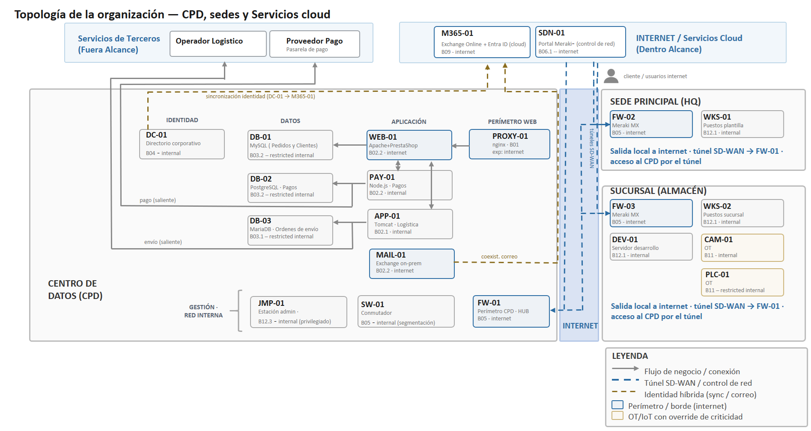

# Inventario de activos

## Escenario

El escenario corresponde a una **PYME de e-commerce ficticia** en proceso de
migración a la nube. Su infraestructura se distribuye en un centro de datos
propio (CPD), una sede principal (HQ) y un almacén, interconectados mediante una
red SD-WAN sobre equipos Meraki. El entorno integra activos tradicionales
(servidores web y de aplicación, bases de datos, correo on-premise), servicios
cloud (Microsoft 365, portal Meraki) y elementos OT/IoT (cámara de
videovigilancia, PLC), lo que produce una superficie de exposición heterogénea.

El conjunto está compuesto por **21 activos** agrupados en **9 módulos
funcionales**. Todos los datos son **ficticios** y se emplean con fines
exclusivamente académicos; no representan infraestructura real.

## Topología

*Topología lógica del escenario: centro de datos (CPD), sede principal (HQ),
almacén y servicios cloud. Se indican los flujos de negocio, los túneles SD-WAN,
la identidad híbrida y los activos OT/IoT sujetos a override de criticidad.*

## Activos del escenario

Valores declarados de entrada de los 21 activos. El fichero
`inventario-21-activos.json` contiene el inventario completo, incluidos los CPE y
los campos calculados por el pipeline.

| ID | Nombre | Software y versión | Exposición | Módulo | Override |
|----|--------|--------------------|------------|--------|----------|
| APP-01 | Gestion logistica | Apache Tomcat 9.0.30 | Interna | B02.1 | — |
| CAM-01 | Camara videovigilancia almacen (Hikvision) | Hikvision DS-2CD7153-E Firmware 4.1.0_b130111 | Interna | B11 | Sí (→ low) |
| DB-01 | BBDD pedidos y clientes | MySQL 8.0 | Interna restringida | B03.2 | — |
| DB-02 | BBDD transacciones de pago | PostgreSQL 12.0 | Interna restringida | B03.2 | — |
| DB-03 | BBDD expediciones | MariaDB 10.5 | Interna restringida | B03.1 | — |
| DC-01 | Domain Controller | Windows Server 2019 build 10.0.17763.5329 | Interna | B04 | — |
| DEV-01 | Servidor de desarrollo | Ubuntu Linux 20.04 | Interna | B12.1 | — |
| FW-01 | Meraki MX hub (CPD) | Cisco Meraki MX250 | Internet | B05 | — |
| FW-02 | Meraki MX spoke (HQ) | Cisco Meraki MX100 | Internet | B05 | — |
| FW-03 | Meraki MX spoke (Sucursal) | Cisco Meraki MX100 | Internet | B05 | — |
| JMP-01 | Estacion de administracion | Windows Server 2019 build 10.0.17763.5329 | Interna | B12.3 | — |
| M365-01 | Correo e identidad cloud (M365) | Microsoft Exchange Online cloud | Internet | B09 | — |
| MAIL-01 | Exchange on-premise | Microsoft Exchange Server 2016 CU20 | Internet | B02.2 | — |
| PAY-01 | Pasarela de pagos | Node.js 14.17.0 | Interna | B02.2 | — |
| PLC-01 | PLC cintas transportadoras almacen (Siemens S7-1200) | Siemens SIMATIC S7-1200 CPU Firmware 4.5.0 | Interna restringida | B11 | — |
| PROXY-01 | Reverse proxy | nginx 1.18.0 | Internet | B01 | — |
| SDN-01 | Meraki Dashboard (plano de control) | Cisco Meraki Dashboard cloud | Internet | B06.1 | — |
| SW-01 | Conmutador de nucleo (CPD) | Cisco Meraki MS | Interna | B05 | — |
| WEB-01 | Servidor tienda (Apache + PrestaShop) | Apache HTTP Server 2.4.49 | Internet | B02.2 | — |
| WKS-01 | Puesto de trabajo HQ | Microsoft Windows 10 22H2 | Interna | B12.1 | — |
| WKS-02 | Puesto de trabajo Sucursal | Microsoft Windows 10 22H2 | Interna | B12.1 | — |

El activo **CAM-01** es el único con criticidad declarada por *override*: un
responsable redujo su criticidad de medio a bajo, activando el factor H del modelo
(véase [`../../1-modelo/`](../../1-modelo/)). El resto conserva la criticidad
derivada de su módulo.

## Parametrización contextual

Cada activo declara los atributos que el modelo emplea para calcular su riesgo
contextual: la **exposición** (Internet, interna, interna restringida), el
**módulo funcional** al que pertenece y, cuando procede, una **criticidad
declarada** mediante override. A partir de estos valores y de la topología, el
pipeline deriva la criticidad normalizada, la sensibilidad del módulo y el radio de
impacto (blast radius) que componen el ContextFactor.

La descripción completa de cada campo del inventario (tipo, origen y significado)
se documenta junto al modelo de datos en
[`../../1-modelo/`](../../1-modelo/).

Para el detalle del pipeline que consume este inventario, véase
[`../../1-modelo/`](../../1-modelo/).
