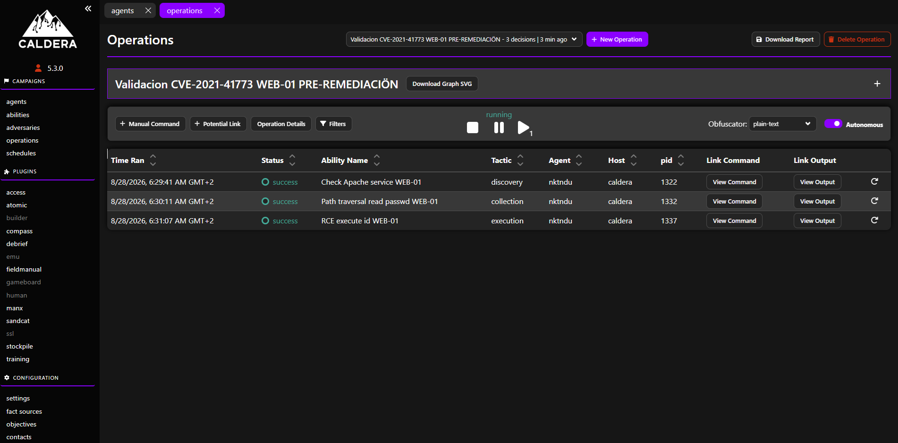
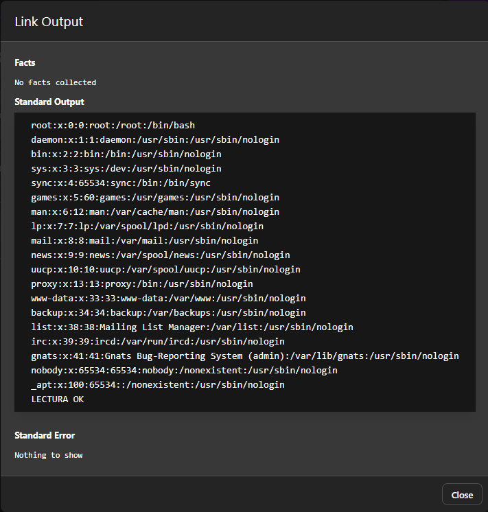
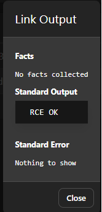

# Evidencias de la validación

Capturas de la ejecución del adversario **Apache 2.4.49 CVE-2021-41773
Validation** sobre WEB-01, en las dos fases del experimento.

## before/ — Apache 2.4.49 (vulnerable)

Con la versión vulnerable, la cadena de ataque se completa con éxito.

| Captura                        | Qué demuestra                                                        |
|--------------------------------|----------------------------------------------------------------------|
| `operacion-success.jpg`        | La operación finaliza con las tres abilities en estado SUCCESS.      |
| `output-ability2-traversal.jpg`| El path traversal devuelve el contenido de `/etc/passwd` (línea `root:`), confirmando la lectura no autorizada. |
| `output-ability3-rce.jpg`      | La ejecución remota devuelve `uid=...` del comando `id`, confirmando el RCE. |

  

La ability de path traversal explota la vulnerabilidad para leer un fichero fuera del directorio web. La salida devuelta muestra el contenido de /etc/passwd, con la línea root: que confirma la lectura no autorizada:

La ability de ejecución remota inyecta el comando id a través de mod_cgi. La salida devuelta muestra la cadena uid=..., que confirma la ejecución de código en el sistema objetivo:

## after/ — Apache 2.4.51 (mitigado)

Tras actualizar a Apache 2.4.51, la misma cadena falla.

| Captura                 | Qué demuestra                                                              |
|-------------------------|----------------------------------------------------------------------------|
| `operacion-failed.jpg`  | La operación finaliza con las abilities en estado FAILED: el path traversal y el RCE quedan bloqueados. La mitigación es efectiva. |

## Interpretación

El contraste before/after valida empíricamente que la vulnerabilidad es
explotable en la versión afectada y que la actualización recomendada la cierra.
Esta evidencia respalda la priorización que el modelo asigna a WEB-01, cuyo CVE
figura en el catálogo KEV de CISA por explotación activa conocida.
